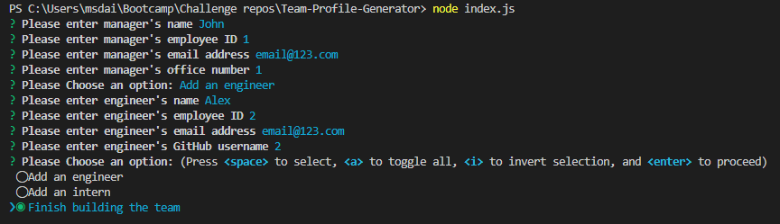

# Team Profile Generator 
  
## Description

This is a node.js application which generates an html page with a profile card for each member of your team 

## Preview

## Table of Contents

- [Installation:](#installation) how to install this app and its dependencies
- [Usage:](#usage) How this app is used
- [Tech:](#tech) Which technologies were used in creating the app
- [Contributing:](#contributing) How to contribute to this app
- [Tests:](#tests) How to carry out tests on this app
- [Questions:](#questions) Contact information to send your questions and feeback to

## Installation

To install this project: 
  
  - Clone the repository to your computer
  - open a terminal and run `npm install`
  - the dependencies to download are `jest`, `fs`, and `enquirer`
  
## Usage

To use the profile generator:

  - Install using the instructions in the [installation](#installation) section
  - Open the terminal and run `node index.js` (ensure you are in the correct directory)
  - Answer the questions for manager details
  - Choose `Add an intern` and answer the questions to create a new intern profile
  - Choose `Add an engineer` and answer the questions to create a new engineer profile
  - Choose `Finish building the team` when you have added all team members
  - Navigate to the output folder and locate the .html file starting with the team manager's name. 

## Tech

- HTML
- Javascript
- Node.js
- inquirer npm
- fs npm
- jest npm 
  
## Contributing

This project is currently finished, but you can get in contact with any of the details in the [questions](#questions) section.
  
## Tests

To test, please follow these instructions:
  - Ensure you have installed jest (if not, follow the instructions in the [installation](#installation) section)
  - Open the terminal and run `npm test`
  - The results of the tests will printed to the terminal

  NOTE: when the tests were working, they all passed. Due to require() not being supported on newer versions I've had to change to "type": "module" in package.json and use import statements instead. I've tried to resolve this so the tests still work but haven't been able to so far. 
  
## Questions

If you have any questions or feedback about this team profile generator, please get in contact with me at:
  - [GitHub:](https://github.com/daisyeverard) https://github.com/daisyeverard; 
  - Email: msdeverard@gmail.com
  
## Credits

`page-template.js` and concept provided by EdX 

## License

MIT License
